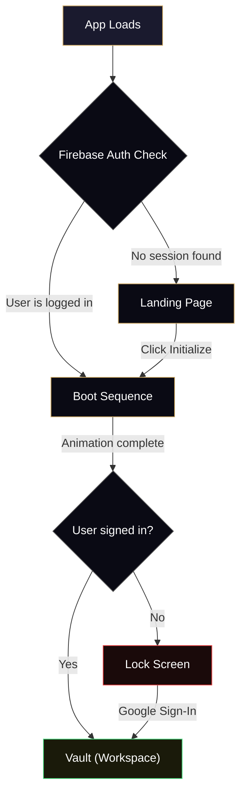
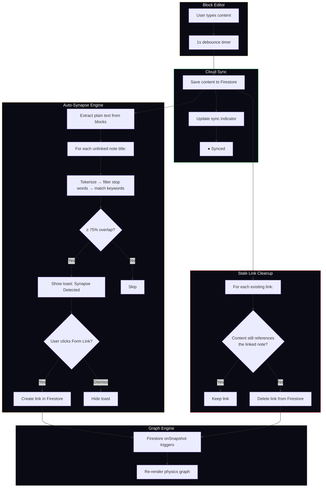
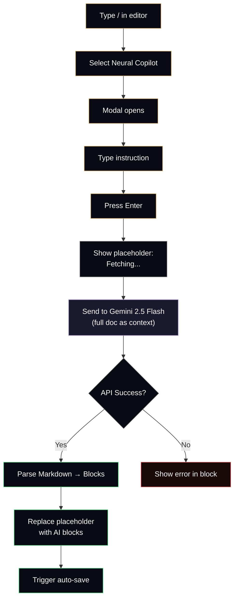

<div align="center">
  <h1> 2ndBrain</h1>
  <p><b>Architect the architecture of your mind.</b></p>
  
  [](#)
  [](#)
  [](#)
  [](#)
  [](#)
  [](#)
  
  <br />
</div>

> **2ndBrain** is a note-taking app that turns your scattered ideas into a living, connected knowledge graph — think Notion meets Obsidian, with a dark cyberpunk aesthetic.

Instead of burying notes in folders, you link them together. The app visualizes those links as an interactive graph, suggests new connections using NLP, and even has an AI writing assistant built right into the editor. Everything syncs to the cloud in real time, and there's a leveling system that rewards you for connecting ideas.

> **🚀 Official Documentation:** [docs.uraj.dev/2ndbrain](https://docs.uraj.dev/2ndbrain) — Read deep dives into the state machine, custom physics engine, AI copilot, and Firestore schema that power 2ndBrain.

---

## 🚀 What's New in v2.0

* **✨ AI Writing Assistant** — Type `/` in the editor and select "Neural Copilot" to open an AI prompt. It sends your entire note as context to Gemini 2.5 Flash and writes directly into your document — summaries, expansions, analysis, whatever you ask for.

* **🔗 Auto-Synapse (Smart Link Suggestions)** — As you type, the app scans your content against all your other note titles. If it finds a strong match (75%+ keyword overlap), a toast pops up at the bottom: *"Synapse Detected: [Note Name]"* — click "Form Link" to connect them instantly.

* **🧹 Stale Link Cleanup** — If you edit a note and remove the content that originally justified a link, the app automatically removes that link. Your graph stays clean without you having to think about it.

* **🔐 Per-User Data Isolation** — All database queries are now filtered by user ID. Your notes, links, and folders are only visible to you.

* **🌐 Portal-Based Modals** — The AI prompt and link suggestion toasts are rendered outside the editor's DOM tree (using React Portals), so they always display correctly on top of everything.

---

## 📜 Version History

| Version | Codename | Highlights |
| :--- | :--- | :--- |
| **v2.0** | Neural Copilot | AI assistant, auto link suggestions, stale link cleanup, per-user isolation |
| **v1.9** | Physics & Persistence | Custom canvas physics engine, organic floating nodes, session persistence |
| **v1.8** | Vault Architecture | Custom folders, folder CRUD, safe folder deletion (notes aren't lost) |
| **v1.7** | The Synapse Release | `@` mention linking, RPG leveling system, confetti on level-up |
| **v1.6** | Vault Cockpit | Google Auth, Firestore real-time sync, three-column layout |
| **v1.5** | Notion-Style Editor | BlockNote integration, rich text editing, smooth page transitions |
| **v1.4** | Editorial & Glass UI | Landing page redesign, glassmorphism panels, serif headings |
| **v1.3** | Refined Landing | Feature cards, polished scroll experience |
| **v1.2** | Graph Shell | Editor + 2D graph in a grid layout |
| **v1.1** | Boot Sequence | Terminal-style loading animation |
| **v1.0** | Genesis | Initial project setup and landing page |

---

## ✦ Core Features

### 🕸️ Bi-Directional Linking & Knowledge Graph

* **`@` Mention Linking** — Type `@` in the editor to search all your notes. Select one to insert a `[[WikiLink]]` and automatically create a two-way connection in the database.
* **Create While Linking** — If the note you're searching for doesn't exist yet, the menu offers a "Create new node" option. It creates the note, inserts the link, and connects them — all in one step.
* **Live Graph Visualization** — The right panel shows a live physics simulation of your selected note and its neighbors. Nodes float, repel each other, and are connected by spring-like links. Click any node to navigate to it.
* **Isolated Node Indicator** — If a note has no connections, the graph dims and shows a hint to start using `@` linking.

### ✨ AI Writing Assistant (Neural Copilot)

* **Built Into the Editor** — Access it through the `/` slash menu (or type `ai`, `copilot`, `gemini`). A modal appears where you describe what you want — "summarize this", "expand on the third point", "write a comparison", etc.
* **Context-Aware** — The AI receives your full document as context, so its responses are relevant to what you're writing about.
* **Writes Directly Into Your Note** — The AI's Markdown response is parsed into editor blocks and inserted in-place. While generating, you see a "✨ Fetching neural response..." placeholder.
* **Handles Errors Gracefully** — If the API call fails, you get a clear error message in the editor instead of a crash.

### 🔗 Auto-Synapse (Smart Link Suggestions)

* **How It Works** — Every time your note saves (1-second debounce), the app extracts the plain text, breaks every note title into keywords (ignoring short/common words), and checks for 75%+ overlap.
* **Non-Intrusive UI** — Suggestions appear as a small toast at the bottom of the screen with two buttons: "Form Link" and "Dismiss". No popups, no interruptions.
* **Automatic Cleanup** — Links that no longer make sense (you removed the relevant content) are automatically deleted from the database.

### ⚡ Editor & Real-Time Sync

* **Block Editor** — Powered by BlockNote, same concept as Notion. Use `/` for formatting (headings, lists, code blocks, etc.) and `@` for linking. Dark theme, Inter font, generous line spacing.
* **Cloud Sync with Status Indicator** — Notes save to Firestore with a 1-second debounce. The top bar shows the current state:
  * `● Synced` (green) — saved to cloud
  * `◌ Syncing...` (gold) — save in progress
  * `○ Unsaved` (gray) — local changes pending
* **Safe Folder Deletion** — When you delete a folder, the notes inside aren't deleted. They just move to "Unassigned" so nothing gets lost.

### 📁 Folders

* **Create, Rename, Delete** — Click `+` to add a folder, use the `⋯` menu to rename or delete. Everything saves instantly to Firestore.
* **Move Notes Between Folders** — Use the dropdown in the editor's top bar to move the current note to any folder.
* **Filter by Folder** — Click a folder in the sidebar to see only its notes. Click "All Nodes" to see everything.

### 🎮 Leveling System

* **XP Formula** — `10 XP` per note created, `25 XP` per link formed. Linking is worth more because connecting ideas is harder than creating them.
* **Level Bar** — Visible in the sidebar. Level = `totalXP ÷ 100 + 1`. The gold progress bar fills up as you approach the next level.
* **Confetti on Level-Up** — When you hit a new level, gold/white/black confetti bursts from both corners of the screen.

### 🔐 Authentication & Session Handling

* **Google Sign-In** — One-click authentication via Firebase. If you're not signed in, you see a lock screen with a "Decrypt via Google" button.
* **Remembers Your Session** — If you've signed in before and come back, the app skips the landing page and drops you straight into the vault (after a quick boot animation).
* **Custom Confirmation Modals** — No native browser alerts. Every destructive action (delete note, delete folder, sign out) shows a styled modal with clear messaging and cancel/confirm buttons.
* **Fullscreen Mode** — Toggle the editor to fill the entire screen for distraction-free writing.

---

## 🏗️ Architecture

### App Flow

The app uses a simple three-state system. When you open it, Firebase checks if you're already logged in. If yes, it skips straight to the boot animation. If not, you land on the marketing page.



### Data Flow — How Notes, Links & AI Work Together

This diagram shows what happens when you type in the editor. Every keystroke (debounced) triggers a chain: save to Firestore, scan for potential links, clean up stale links, and update the graph.



### AI Copilot Flow

When you trigger the Neural Copilot from the slash menu, here's the full pipeline from your prompt to the final blocks appearing in your note.



---

## 🧩 Component Tree

```
App.jsx
├── LandingPage.jsx          — Marketing page with editorial scroll sections
│   ├── Glass Navbar         — Frosted-glass fixed navigation
│   ├── Hero Section         — Large serif headline + subtitle
│   ├── Ticker Marquee       — Scrolling concept keywords
│   ├── Feature Panels       — "Anatomy of Thought" triple-panel grid
│   ├── Workflow Steps       — I. Capture → II. Summarize → III. Synthesize
│   └── CTA + Footer         — "Stop Forgetting." + author credit
│
├── BootSequence.jsx         — Terminal-style loading screen
│   ├── Log Messages         — 6 boot messages appearing sequentially
│   ├── Progress Bar         — Smooth fill from 0% to 100%
│   └── Blinking Cursor      — Classic terminal cursor
│
└── Vault.jsx                — The main workspace (3-column layout)
    ├── Lock Screen          — Shown when not signed in
    ├── Confirmation Modals  — Custom animated modals for destructive actions
    │
    ├── Left Column (260px, collapsible to 68px)
    │   ├── XP / Level Bar   — Cognitive Level progress
    │   ├── New Node Button   — Creates a new note
    │   ├── Folder List       — CRUD for custom directories
    │   └── Sign Out          — With confirmation modal
    │
    ├── Center Column (flexible width)
    │   ├── Top Bar           — Sync status, folder picker, delete, fullscreen toggle
    │   ├── Title Input       — Large editable title
    │   └── BlockEditor.jsx   — The rich text editor
    │       ├── / Slash Menu   — Formatting + AI Copilot trigger
    │       ├── @ Mention Menu — Note linking + inline creation
    │       ├── AI Modal       — Neural Copilot prompt (via Portal)
    │       └── Synapse Toast  — Auto-link suggestion (via Portal)
    │
    └── Right Column (340px)
        ├── GraphEngine.jsx  — Custom canvas-based physics graph
        └── Cloud Nodes List — Clickable list of notes in current folder
```

---

## 🗄️ Database Schema (Firestore)

Three collections, all scoped to the logged-in user:

```
Firestore
├── nodes/
│   └── {nodeId}
│       ├── name: string          → Note title
│       ├── content: string       → JSON-serialized editor content
│       ├── val: number           → Node weight (default: 3)
│       ├── folder: string|null   → Folder ID (null = unassigned)
│       ├── createdAt: number     → Timestamp
│       └── userId: string        → Owner's Firebase UID
│
├── links/
│   └── {linkId}
│       ├── source: string        → Source note ID
│       ├── target: string        → Target note ID
│       └── userId: string        → Owner's Firebase UID
│
└── folders/
    └── {folderId}
        ├── name: string          → Folder name
        ├── createdAt: number     → Timestamp
        └── userId: string        → Owner's Firebase UID
```

All reads use real-time `onSnapshot` listeners, so changes from any device show up instantly.

---

## 🔬 Physics Engine

The graph in the right panel (`GraphEngine.jsx`) is a custom physics simulation built on the HTML5 Canvas API — no libraries. Here's how it works:

**Five forces act on every node, every frame:**

| Force | What It Does | How |
| :--- | :--- | :--- |
| **Center Gravity** | Pulls nodes toward the middle of the canvas | `velocity += (center - position) × 0.01` |
| **Organic Float** | Adds a subtle, continuous drift so nodes feel alive | `velocity += sin(time × speed + phase) × 0.03` |
| **Repulsion** | Pushes nodes apart to prevent overlap | `force = 1500 / distance²` (inverse square law) |
| **Spring Links** | Pulls connected nodes toward an ideal distance | `force = (distance - 80) × 0.05` |
| **Damping** | Friction — slows everything down gradually | `velocity *= 0.85` per frame |

Each node gets random phase offsets for the float force, so they don't all move in sync — it feels organic and alive.

**Clicking on nodes:** The engine calculates the distance from your click to each node center. If you're within 10px of a node, it triggers navigation.

---

## 🎨 Design System

### Colors

| Color | Hex | Where It's Used |
| :--- | :--- | :--- |
| Gold (accent) | `#cfa861` | Buttons, highlights, XP bar, link indicators, active states |
| Near-black | `#020203` | Main background |
| Panel dark | `#050508` | Sidebar, right column |
| Muted gray | `#888888` | Secondary text, labels, descriptions |
| Green | `#4ade80` | "Synced" status |
| Red | `#ef4444` | Delete buttons, error states |
| Border | `#1a1a1a` | Dividers between panels |

### Fonts

| Font | Type | Used For |
| :--- | :--- | :--- |
| Inter | Sans-serif | Body text, editor, navigation, buttons |
| Playfair Display | Serif | Landing page headings, hero titles, level numbers |
| Courier New | Monospace | System labels, boot sequence, ticker, status text |

### Animations

| Animation | Duration | Where |
| :--- | :--- | :--- |
| Fade up | 1s | Landing page sections appearing on scroll |
| Float | 6s | Glass panels drifting up and down |
| Glow pulse | 8s | Background orbs pulsing subtly |
| Marquee scroll | 60s | Ticker tape scrolling infinitely |
| Page fade-in | 0.3s | Switching between notes in the editor |
| Cursor blink | 1s | Boot sequence terminal cursor |
| Sidebar collapse | 0.3s | Sidebar shrinking/expanding |
| Modal spring | — | Modals bouncing in with Framer Motion |

### Vault Layout

```
┌────────────────┬──────────────────────────────────────────┬──────────────────┐
│  Left Column   │              Center Column               │  Right Column    │
│   (260px)      │              (flex: 1)                   │   (340px)        │
│                │                                          │                  │
│  ☰ Vault       │  ┌─ Top Bar ─────────────────────────┐   │  ┌─ Graph ────┐  │
│  ▰▰▰▰░░ Lv.3  │  │ ● Synced  | /Folder ▼ | 🗑️ | ⛶  │   │  │ (Canvas)   │  │
│                │  └───────────────────────────────────┘   │  │  Live       │  │
│  + New Node    │                                          │  │  Physics    │  │
│                │  ┌─ Editor ──────────────────────────┐   │  └────────────┘  │
│  DIRECTORY     │  │                                   │   │                  │
│  ▸ All Nodes   │  │   Note Title                      │   │  ┌─ Notes ───┐  │
│  ▸ Research    │  │                                   │   │  │ Note 1     │  │
│  ▸ Projects    │  │   Start typing here...            │   │  │ Note 2     │  │
│                │  │   (/ for commands, @ for links)   │   │  │ Note 3     │  │
│  Sign Out      │  │                                   │   │  │            │  │
│                │  └───────────────────────────────────┘   │  └────────────┘  │
└────────────────┴──────────────────────────────────────────┴──────────────────┘
```

---

## 🛠️ Tech Stack

| Category | Technology | Version | What It Does |
| :--- | :--- | :--- | :--- |
| **Frontend** | React | v19.2.4 | UI components and state management |
| **Build** | Vite | v8.0.4 | Dev server with hot reload, production bundler |
| **Backend** | Firebase | v12.11.0 | Google Auth + Firestore (real-time database) |
| **AI** | Google Generative AI | v0.24.1 | Powers the Gemini 2.5 Flash writing assistant |
| **Editor** | BlockNote | v0.47.3 | Block-based rich text editor (core + react + mantine) |
| **Animation** | Framer Motion | v12.38.0 | Page transitions, modal animations, list enter/exit |
| **Effects** | canvas-confetti | v1.9.4 | Level-up celebration particles |
| **Styling** | Custom CSS | — | 778 lines of hand-written dark theme styles |
| **Linting** | ESLint | v9.39.4 | Code quality (React Hooks + React Refresh plugins) |

> **Note:** `react-force-graph-2d`, `react-force-graph-3d`, and `three` are still in `package.json` as legacy dependencies from before the custom physics engine was built in v1.9. They're no longer used in the app.

---

## 📂 Project Structure

```
second-brain/
├── index.html                    # Vite entry — loads /src/main.jsx
├── package.json                  # Dependencies & npm scripts
├── vite.config.js                # Vite config (React plugin)
├── eslint.config.js              # ESLint flat config
├── .env                          # VITE_GEMINI_API_KEY
├── .gitignore                    # Ignores node_modules, dist, .env
│
├── public/
│   ├── favicon.svg               # App favicon
│   ├── icons.svg                 # Icon sprite
│   └── puzzle.png                # Browser tab icon
│
├── src/
│   ├── main.jsx                  # React entry point (StrictMode)
│   ├── App.jsx                   # State machine (landing → boot → vault)
│   ├── firebase.js               # Firebase init (Firestore, Auth, Google provider)
│   ├── index.css                 # All styles (778 lines)
│   │
│   ├── assets/
│   │   ├── hero.png              # Landing page image
│   │   ├── react.svg             # React logo
│   │   └── vite.svg              # Vite logo
│   │
│   └── components/
│       ├── LandingPage.jsx       # Marketing page (235 lines)
│       ├── BootSequence.jsx      # Boot animation (74 lines)
│       ├── Vault.jsx             # Main workspace (651 lines)
│       ├── BlockEditor.jsx       # Editor + AI + NLP (416 lines)
│       ├── GraphEngine.jsx       # Canvas physics engine (240 lines)
│       └── GraphView.jsx         # Deprecated (empty file)
│
└── html-prototype/               # Original static prototype (pre-React)
    ├── index.html                # Landing page
    ├── boot.html                 # Boot animation
    ├── vault.html                # Vault with Force Graph 2D
    └── style.css                 # Shared styles
```

---

## ⚙️ Getting Started

### 1. Clone & Install

```bash
git clone https://github.com/yuvrajshrirame/second-brain.git
cd second-brain
npm install
```

### 2. Set Up Firebase

1. Go to the [Firebase Console](https://console.firebase.google.com/) and create a new project.
2. Enable **Authentication** → Google Sign-In provider.
3. Enable **Firestore Database** (start in Test Mode or set up security rules).
4. Register a **Web App** and copy your config keys.
5. Update the config in `src/firebase.js`:

```javascript
const firebaseConfig = {
  apiKey: "your_api_key",
  authDomain: "your_project.firebaseapp.com",
  projectId: "your_project_id",
  storageBucket: "your_project.appspot.com",
  messagingSenderId: "your_sender_id",
  appId: "your_app_id"
};
```

### 3. Set Up Gemini AI (Optional)

To use the AI writing assistant, get an API key from [Google AI Studio](https://aistudio.google.com/apikey) and create a `.env` file:

```bash
VITE_GEMINI_API_KEY=your_gemini_api_key_here
```

> The AI copilot uses `gemini-2.5-flash`. Without this key, everything else still works — the AI feature just won't be available.

### 4. Run It

```bash
npm run dev
```

Open `http://localhost:5173` in your browser.

### Available Commands

| Command | What It Does |
| :--- | :--- |
| `npm run dev` | Start dev server with hot reload |
| `npm run build` | Build for production |
| `npm run preview` | Preview the production build |
| `npm run lint` | Run ESLint on all JS/JSX files |

---

## 🌐 Landing Page

The marketing page is a long editorial scroll with these sections:

| # | Section | Headline |
| :--- | :--- | :--- |
| — | Navigation | Frosted-glass navbar with "Initialize" button |
| — | Hero | *"Architect the architecture of your mind."* |
| — | Ticker | Scrolling marquee of 14 concepts |
| 01 | Topology | *"See your thoughts in orbit."* |
| 02 | Capture | *"Zero-Friction entry."* |
| — | Anatomy of Thought | Triple-panel grid (Graph, Capture, Ontology) |
| — | The Workflow | I. Capture → II. Summarize → III. Synthesize |
| — | CTA | *"Stop Forgetting."* |
| — | Footer | Version tag + author credit |

---

## 🧠 NLP Engine Details

The Auto-Synapse feature runs entirely in the browser — no API calls needed.

**Stop words filtered out:**
```
a, an, the, and, or, but, to, of, in, for, on, with, as, is, it, this, that, at, by, from
```

**How matching works:**
1. Grab all the text from the editor.
2. For each note you haven't linked to yet:
   - First check: does the text literally contain the note's name?
   - If not: split the note name into words, drop anything ≤ 2 characters or in the stop word list.
   - Count how many of those words appear in the text.
   - If 75% or more match → suggest a link.
3. For each note you *have* linked to:
   - If neither the name nor `[[NoteName]]` appears in the text anymore → delete the link.

**Why 75%?** It's a balance. Too low and you'd get false positives from single common words. Too high and you'd miss legitimate multi-word matches (like catching "Information Architecture" when 3 of 4 keywords are present).

---

## 🧪 HTML Prototype

The `html-prototype/` directory is where the project started — a static HTML/CSS/JS prototype before migrating to React. It includes:

* `index.html` — Simple landing page with a single button
* `boot.html` — Loading animation with a spinner
* `vault.html` — Three-column layout with a CDN-loaded Force Graph 2D library and contentEditable editor
* `style.css` — Shared CSS variables and fade-in animation

This prototype used `window.location.href` for routing and CDN scripts for dependencies — all replaced by React components and npm packages in the real app.

---

## 🔑 Environment Variables

| Variable | Required? | Description |
| :--- | :--- | :--- |
| `VITE_GEMINI_API_KEY` | For AI features | Gemini API key. Without it, the AI copilot shows an error, but everything else works fine. |

> Firebase credentials are currently hardcoded in `src/firebase.js`. For a production deployment, you'd want to move them to `.env` variables prefixed with `VITE_FIREBASE_*`.

---

## 📄 License

This project is currently unlicensed. All rights reserved by the author.

---

<div align="center">
  <br />
  <p style="color: #444; font-family: monospace; font-size: 0.7rem; letter-spacing: 2px;">
    SYSTEM.v2.0 // COGNITIVE ARCHITECTURE // DESIGNED FOR FOCUS
  </p>
  <p><b>Made with ❤️ by <a href="https://github.com/yuvrajshrirame">Yuvraj Shrirame</a></b></p>
</div>